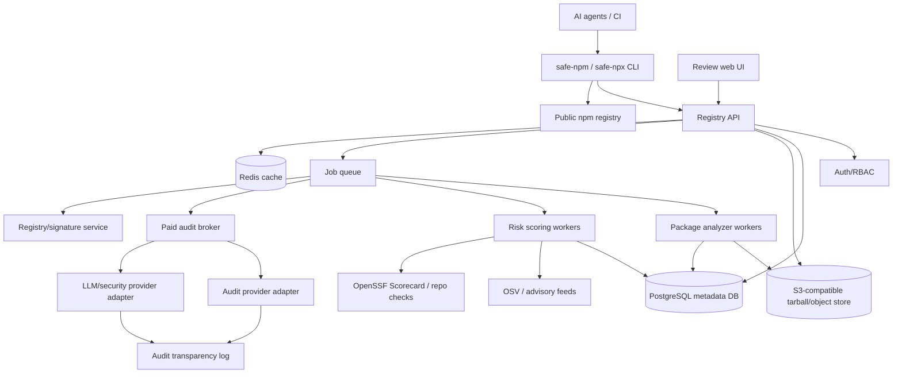
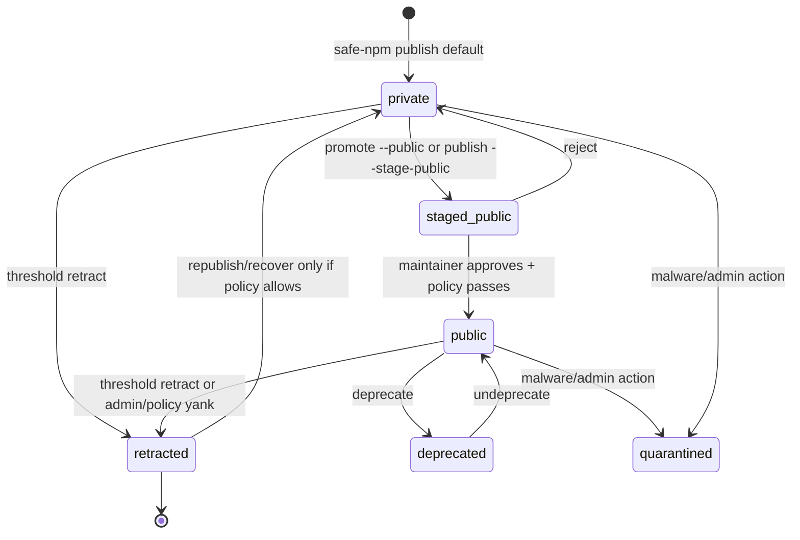
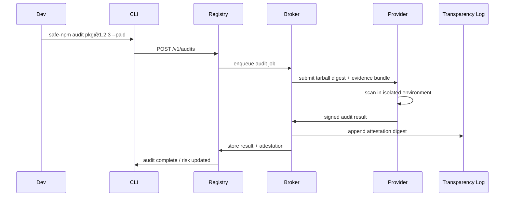

# Design: `npm` and `npx` that Theo wants

Status: implementation design for a coding agent  
Date: 2026-06-28  
Working product names: `safe-npm` and `safe-npx` for the MVP; optional user aliases can later map them to `npm` and `npx`.

> Do not ship binaries literally named `npm` or `npx` by default. Those names already exist and may be trademarked. Implement wrappers with clear names first, then support opt-in shell aliases.

---

## 1. Objective

Build a compatibility-first package registry and CLI layer that makes package publication, installation, and one-off execution safer and more reversible while staying usable for existing JavaScript projects.

The product has four core jobs:

1. **Private-first publishing**: `safe-npm publish` publishes to a private registry by default. Public release is an explicit promotion step.
2. **Reversible early mistakes**: allow maintainers to retract/unpublish package versions when they are below the agreed impact threshold: fewer than 100 observed installs or live for less than 5 hours.
3. **Install-time transparency**: show package size, publisher, maintainers, provenance, source visibility, obfuscation/readability, install scripts, inferred permissions, known vulnerabilities, typosquat risk, and a security score before install or execution.
4. **Safer `npx` execution**: one-off command execution must display risk and permission information before running, and must expose a machine-readable mode for AI agents and CI systems.

---

## 2. Current ecosystem baseline, as of 2026-06-28

These facts affect the design and should be treated as compatibility constraints.

| Area | Current npm behavior or capability | Design implication |
|---|---|---|
| Unpublish | npm allows unpublish of newly created packages within 72 hours if there are no public-registry dependents. After 72 hours, unpublish requires no dependents, fewer than 300 downloads over the last week, and a single owner/maintainer. npm also keeps name+version tuples immutable. Source: https://docs.npmjs.com/policies/unpublish/ | Our registry can provide Theo's desired shorter threshold, but must preserve lockfile safety and avoid cache poisoning when a version is republished. |
| Staged publishing | npm supports `npm stage publish`, `npm stage list`, `npm stage view`, `npm stage download`, and 2FA-gated approval before a staged package goes live. Source: https://docs.npmjs.com/staged-publishing/ | Use staging as the default public-release pattern. Our registry should stage all public promotions and inspect tarballs before publish. |
| Trusted publishing | npm supports OIDC-based trusted publishing from GitHub Actions, GitLab CI/CD, and CircleCI with npm CLI and Node version requirements. Source: https://docs.npmjs.com/trusted-publishers/ | Prefer OIDC over long-lived publish tokens. Model trusted publishers at the package scope and action level. |
| Provenance | npm provenance can provide build/source attestations signed by Sigstore and logged in a transparency ledger, but npm explicitly warns that provenance does not prove absence of malicious code. Source: https://docs.npmjs.com/generating-provenance-statements/ | Treat provenance as a positive signal, not a pass/fail security result. |
| Registry signatures | npm uses ECDSA registry signatures; third-party registries can support signatures by publishing signatures in version `dist` metadata and keys at `/-/npm/v1/keys`. Source: https://docs.npmjs.com/about-registry-signatures/ | Our private registry must sign packages and expose npm-compatible keys. |
| `npx` | `npx`/`npm exec` runs local or remote package commands. If a package is absent locally, it installs to an npm cache folder and prompts before installing; the prompt can be suppressed. Source: https://docs.npmjs.com/cli/v8/commands/npx/ | Replace the weak yes/no prompt with a risk card and policy engine before any package is fetched/executed. |
| Private packages | npm private packages are always scoped, and scoped packages default to private visibility on publish. Source: https://docs.npmjs.com/about-scopes/ and https://docs.npmjs.com/creating-and-publishing-private-packages/ | Keep scoped compatibility but add organization/workspace/private registry ACLs with better sharing UX. |
| Install scripts | npm 11.17 has `approve-scripts` and `deny-scripts`; current release is advisory, and a future release is planned to block unreviewed dependency install scripts. Source: https://docs.npmjs.com/cli/v11/commands/npm-approve-scripts/ and https://github.blog/changelog/2026-06-09-upcoming-breaking-changes-for-npm-v12/ | Model install-script approval as first-class policy. For one-off `safe-npx`, use per-user policy because there is no project `package.json`. |
| Runtime permissions | Node's Permission Model is stable behind the `--permission` flag, with granular resource controls. Source: https://nodejs.org/api/permissions.html | Enforce permissions for Node-based CLIs where possible; clearly mark native binaries and unsupported cases as not enforceable. |
| Vulnerability and repo health signals | OSV provides machine-readable vulnerability data; OpenSSF Scorecard provides repo security-health checks. Sources: https://osv.dev/ and https://scorecard.dev/ | Build a multi-source scoring system instead of inventing every signal. |

---

## 3. Product principles

1. **Compatibility first**: existing `package.json`, package-lock, npm package specs, semver, dist-tags, and tarballs should keep working.
2. **Private by default, public by intent**: accidental public publication should be harder than intentional public publication.
3. **Explainability beats a single number**: show a score, but always show which facts produced it.
4. **Trust must be externally attestable**: trusted audits must be signed by the registry or approved third-party providers; local-only AI results are advisory.
5. **Lockfile safety**: retracting or republishing must not mutate previously referenced artifacts silently.
6. **Agent-friendly operation**: all user-facing prompts must have JSON equivalents and deterministic exit codes.
7. **No hidden execution**: never run install scripts, package bins, or lifecycle hooks before the risk engine has inspected the target artifact.
8. **Policy before convenience**: unsafe package sources, suspicious diffs, high-risk permissions, and maintainer takeovers must block by default in strict modes.

---

## 4. Scope

### 4.1 In scope

- `safe-npm` CLI wrapper for `install`, `ci`, `publish`, `stage`, `promote`, `unpublish`/`retract`, `audit`, `view`, `trust`, `share`, and `login`.
- `safe-npx` CLI wrapper for one-off package execution.
- npm-compatible registry service with private packages, ACLs, signed tarballs, packuments, dist-tags, and npm-compatible metadata reads.
- Public npm proxy/cache mode for packages not hosted in the private registry.
- Version-level security/risk scoring.
- Static package analysis, diff analysis, maintainer/event analysis, provenance/signature validation, vulnerability lookup, and typosquat heuristics.
- Paid third-party audit broker with signed audit attestations.
- Threshold-based retraction/unpublishing policy.
- Runtime permission declarations and best-effort permission enforcement for Node CLI entrypoints.
- Machine-readable policy mode for agents and CI.
- Minimal web UI for reviewing staged packages and paid audit reports.

### 4.2 Out of scope for MVP

- Replacing the official npm public registry.
- Full replication of every npm website feature.
- Guaranteed sandboxing for arbitrary native binaries on every operating system.
- Fully automated legal/trademark dispute resolution.
- Permanent archival of every public npm tarball.
- A perfect malicious-code detector. The scoring system is probabilistic and evidence-based.

---

## 5. High-level architecture



### 5.1 Recommended implementation stack

Use a TypeScript monorepo for speed and compatibility with npm ecosystem libraries.

```text
repo/
  apps/
    cli/                  # safe-npm and safe-npx binaries
    registry-api/         # Fastify HTTP API, npm-compatible endpoints
    web/                  # minimal review UI
    workers/              # analyzer, scorer, audit broker workers
  packages/
    core-types/           # shared zod schemas and TypeScript types
    npm-compat/           # packument, semver, npm spec, tarball helpers
    analyzer/             # static/diff/permission analyzers
    scoring/              # score formula and policy evaluator
    auth/                 # token, OIDC, RBAC helpers
    storage/              # object store and metadata repositories
    audit-providers/      # provider adapters
    sandbox/              # Node permission and OS sandbox adapters
  infra/
    docker-compose.yml
    migrations/
    k8s/
```

Suggested libraries:

- API: Fastify, Zod, OpenAPI generator.
- Database: PostgreSQL with Drizzle or Prisma migrations.
- Queue: BullMQ or Graphile Worker.
- Cache/rate limiting: Redis.
- Object store: S3-compatible API; local MinIO for dev.
- npm compatibility: `pacote`, `npm-package-arg`, `semver`, `ssri`, `tar`, `cacache`, `npm-registry-fetch`, `@npmcli/arborist` where appropriate.
- CLI: `commander` or `clipanion`, `ink` optional for rich TTY output, `execa` for controlled subprocess execution.
- Static analysis: Babel parser, SWC parser, Acorn, `es-module-lexer`, tree-sitter optional.
- SBOM: CycloneDX package tools or SPDX generator.
- Signing: ECDSA P-256 via KMS where possible; local dev key only for development.
- Auth: WebAuthn/passkeys for humans, OIDC for CI, short-lived scoped PATs for automation.

---

## 6. Main components

### 6.1 CLI: `safe-npm`

`safe-npm` is the developer-facing package manager wrapper.

Primary commands:

```text
safe-npm install [pkg...]
safe-npm ci
safe-npm publish [--private | --public | --stage-public] [--audit=off|basic|paid]
safe-npm stage publish
safe-npm stage list [pkg]
safe-npm stage view <stage-id>
safe-npm stage download <stage-id>
safe-npm stage approve <stage-id>
safe-npm promote <pkg>@<version> --public
safe-npm retract <pkg>@<version> --reason <text>
safe-npm unpublish <pkg>@<version> --reason <text>
safe-npm view <pkg> [--risk] [--json]
safe-npm audit <pkg>@<version> --paid|--basic
safe-npm trust approve <pkg>@<version> [--permissions <file>]
safe-npm trust deny <pkg>
safe-npm share <pkg> --user <user> --role read|write
safe-npm grant-token <pkg> --ttl 24h --command exec|install|publish
safe-npm login
safe-npm logout
```

Implementation behavior:

- For read/install commands, resolve packages against the private registry first, then public npm proxy/cache depending on project policy.
- For install commands, generate a preflight risk report before delegating to npm installation primitives.
- For publish commands, run `npm pack --json` or equivalent packing logic, inspect the tarball, then upload to the private registry unless `--stage-public` or `--public` is explicit.
- For public promotion, require a staged release review and a policy pass.
- Preserve npm-compatible flags where possible; unknown flags should be forwarded carefully only after preflight.

### 6.2 CLI: `safe-npx`

`safe-npx` is the safer one-off execution layer.

Primary commands:

```text
safe-npx <pkg>[@version] [args...]
safe-npx --package <pkg> -- <cmd> [args...]
safe-npx preflight <pkg>[@version] --json
safe-npx explain <pkg>[@version]
safe-npx scan-skill <path/to/SKILL.md> --json
safe-npx policy init
safe-npx policy test <risk-report.json>
```

Execution flow:

1. Parse npm package spec.
2. Resolve exact package version and bin name without executing package code.
3. Download the tarball to a quarantine cache.
4. Analyze tarball and compute security score.
5. Render risk card or JSON risk report.
6. Apply user/project/agent policy.
7. If allowed, install into an isolated execution cache with install-script behavior controlled by policy.
8. Execute the selected bin with declared/enforced permissions where possible.

Agent mode:

- Enabled by `--agent`, `--json`, `SAFE_NPX_AGENT=1`, or non-interactive CI defaults.
- No prompts.
- Emits deterministic JSON to stdout.
- Uses exit codes:

```text
0   preflight passed and command executed successfully
10  policy requires human approval
11  policy blocked execution
12  audit/security data unavailable and policy requires it
13  package could not be resolved
14  package resolved but no executable bin was safely selectable
15  sandbox/permission enforcement unavailable but required
20+ child command exit codes, offset or encoded in JSON when possible
```

### 6.3 Registry API

The registry API serves both npm-compatible endpoints and native safety endpoints.

#### npm-compatible read endpoints

Implement enough compatibility for npm CLI and `pacote` clients:

```http
GET /<encoded-package-name>
GET /<encoded-package-name>/-/<tarball-name>.tgz
GET /-/npm/v1/keys
```

The packument response must include:

- `name`
- `dist-tags`
- `versions`
- version `dist.tarball`
- version `dist.integrity`
- version `dist.shasum` where applicable
- version `dist.signatures` for ECDSA registry signatures
- `time`
- `maintainers`
- `deprecated` warnings

#### native safety endpoints

```http
POST   /v1/packages
GET    /v1/packages/:name
GET    /v1/packages/:name/versions/:version
GET    /v1/packages/:name/versions/:version/risk
POST   /v1/packages/:name/versions/:version/retract
POST   /v1/packages/:name/versions/:version/deprecate
POST   /v1/packages/:name/versions/:version/promote-public

POST   /v1/stage
GET    /v1/stage
GET    /v1/stage/:stageId
DELETE /v1/stage/:stageId
POST   /v1/stage/:stageId/approve
GET    /v1/stage/:stageId/tarball

POST   /v1/preflight/install
POST   /v1/preflight/exec
POST   /v1/audits
GET    /v1/audits/:auditId
GET    /v1/audit-attestations/:digest

POST   /v1/shares
DELETE /v1/shares/:shareId
POST   /v1/grants/short-lived-token

GET    /v1/policies/:scope
PUT    /v1/policies/:scope
```

### 6.4 Web UI

Keep the UI minimal for MVP:

- Login/passkey/OIDC login.
- Package overview.
- Version risk page.
- Staged release review page.
- Diff viewer.
- Audit findings viewer.
- Approve/reject public promotion.
- Share/access management.
- Organization policy editor.

Do not build a full npmjs.com clone until the API and CLI are stable.

### 6.5 Workers

Workers are asynchronous, idempotent, and content-addressed.

Worker classes:

1. `tarball-ingest-worker`: validates tarball, computes integrity/digest, stores in object storage.
2. `metadata-worker`: extracts package metadata, scripts, bins, dependencies, license, repository, files.
3. `static-analysis-worker`: finds suspicious APIs, obfuscation, minification, native artifacts, secrets, dynamic execution, network/file/process usage.
4. `diff-worker`: compares new release against previous version and summarizes changed files/functions.
5. `provenance-worker`: validates provenance/signatures when present.
6. `typosquat-worker`: computes name similarity and namespace risk.
7. `vulnerability-worker`: queries OSV/advisory sources and caches results.
8. `score-worker`: builds version-level and package-level scorecards.
9. `audit-broker-worker`: sends paid audit jobs to approved third-party providers.
10. `signature-worker`: signs registry metadata and audit attestations.
11. `install-count-rollup-worker`: aggregates install events into threshold counters.

---

## 7. Data model

Use PostgreSQL as the source of truth. Use object storage for tarballs, unpacked analysis artifacts, SBOMs, and signed attestations.

### 7.1 Core entities

```sql
users(
  id uuid primary key,
  username text unique not null,
  email text unique,
  created_at timestamptz not null,
  passkey_enabled boolean not null default false,
  risk_flags jsonb not null default '{}'
)

orgs(
  id uuid primary key,
  name text unique not null,
  created_at timestamptz not null,
  default_visibility text not null default 'private',
  policy_id uuid
)

memberships(
  org_id uuid references orgs(id),
  user_id uuid references users(id),
  role text not null,
  primary key(org_id, user_id)
)

packages(
  id uuid primary key,
  name text unique not null,
  scope text,
  owner_org_id uuid references orgs(id),
  owner_user_id uuid references users(id),
  visibility text not null check (visibility in ('private','public','quarantined')),
  created_at timestamptz not null,
  updated_at timestamptz not null,
  name_risk jsonb not null default '{}'
)

package_versions(
  id uuid primary key,
  package_id uuid references packages(id),
  version text not null,
  publish_id uuid not null,
  status text not null check (status in (
    'private','staged_public','public','retracted','deprecated','quarantined','deleted'
  )),
  published_at timestamptz not null,
  publisher_user_id uuid references users(id),
  tarball_object_key text not null,
  tarball_sha512 text not null,
  tarball_shasum text,
  unpacked_size_bytes bigint,
  file_count integer,
  provenance_status text,
  source_repository_url text,
  source_commit_sha text,
  metadata jsonb not null default '{}',
  unique(package_id, version, publish_id)
)

version_aliases(
  package_id uuid references packages(id),
  version text not null,
  active_publish_id uuid not null,
  created_at timestamptz not null,
  primary key(package_id, version)
)

dist_tags(
  package_id uuid references packages(id),
  tag text not null,
  version text not null,
  publish_id uuid not null,
  updated_at timestamptz not null,
  primary key(package_id, tag)
)
```

Key point: `package_versions` is unique by `(package_id, version, publish_id)`, not only `(package_id, version)`. This allows safe semver tuple reuse only by creating a new `publish_id` and a new tarball URL. The active visible version is controlled by `version_aliases`. Old lockfile tarball URLs must keep resolving to their original content during the configured retention window.

### 7.2 Retraction/unpublish entities

```sql
version_retractions(
  id uuid primary key,
  package_version_id uuid references package_versions(id),
  actor_user_id uuid references users(id),
  reason text not null,
  mode text not null check (mode in ('threshold_retract','admin_quarantine','policy_yank')),
  observed_installs_at_retract integer not null,
  age_seconds_at_retract integer not null,
  semver_reuse_allowed boolean not null,
  created_at timestamptz not null
)

install_events(
  id bigserial primary key,
  package_version_id uuid references package_versions(id),
  event_type text not null check (event_type in ('manifest_resolve','tarball_fetch','exec_preflight','install_success')),
  privacy_bucket text not null,
  user_agent_hash text,
  created_at timestamptz not null
)

install_rollups(
  package_version_id uuid references package_versions(id),
  window_start timestamptz not null,
  window_end timestamptz not null,
  unique_install_count integer not null,
  tarball_fetch_count integer not null,
  primary key(package_version_id, window_start, window_end)
)
```

Counting policy:

- `observed_installs` means unique successful tarball fetches or explicit install-success reports, deduplicated by privacy bucket.
- Privacy buckets use a daily rotating server-side salt and coarse dimensions such as account/org when authenticated, or hashed IP prefix + user-agent family when anonymous.
- Counts are approximate because caches and mirrors hide some installs. The threshold is intended to limit blast radius, not produce legal-grade install counts.

### 7.3 Risk and audit entities

```sql
risk_reports(
  id uuid primary key,
  package_version_id uuid references package_versions(id),
  score integer not null check (score between 0 and 100),
  tier text not null check (tier in ('excellent','good','caution','danger','blocked')),
  confidence integer not null check (confidence between 0 and 100),
  generated_at timestamptz not null,
  analyzer_version text not null,
  evidence_digest text not null,
  report jsonb not null
)

audit_jobs(
  id uuid primary key,
  package_version_id uuid references package_versions(id),
  requester_user_id uuid references users(id),
  provider_id uuid,
  mode text not null check (mode in ('basic','paid','byo_advisory')),
  status text not null check (status in ('queued','running','passed','warned','failed','errored','cancelled')),
  cost_cents integer,
  created_at timestamptz not null,
  completed_at timestamptz,
  result jsonb
)

audit_attestations(
  id uuid primary key,
  audit_job_id uuid references audit_jobs(id),
  package_version_id uuid references package_versions(id),
  statement_type text not null,
  signed_payload jsonb not null,
  signature text not null,
  transparency_log_url text,
  created_at timestamptz not null
)
```

### 7.4 Permission entities

```sql
permission_reports(
  id uuid primary key,
  package_version_id uuid references package_versions(id),
  declared_permissions jsonb not null default '{}',
  inferred_permissions jsonb not null default '{}',
  enforceability jsonb not null default '{}',
  generated_at timestamptz not null
)

policy_sets(
  id uuid primary key,
  scope_type text not null check (scope_type in ('user','org','project','ci','agent')),
  scope_id text not null,
  policy jsonb not null,
  created_at timestamptz not null,
  updated_at timestamptz not null
)
```

---

## 8. Version lifecycle

### 8.1 States



### 8.2 Private publish flow

1. Developer runs `safe-npm publish`.
2. CLI packs tarball locally without executing untrusted dependency code.
3. CLI uploads tarball and metadata to registry.
4. Registry stores tarball in content-addressed object storage.
5. Registry creates `package_versions.status = private`.
6. Workers analyze package and generate risk report.
7. Package is installable only by users/groups with ACL access.

Default publish must be private even if the package is unscoped in its `package.json`. If an unscoped private package would be incompatible with npm semantics, the CLI should either:

- rewrite only the registry namespace internally while preserving package name in tarball metadata; or
- require the user to choose or create a scope on first publish.

The cleaner implementation is to require a scope for private packages unless the registry explicitly supports private unscoped packages.

### 8.3 Public promotion flow

1. Developer runs `safe-npm promote <pkg>@<version> --public` or `safe-npm publish --stage-public`.
2. Registry creates a `staged_public` version or stage record.
3. Required checks run:
   - tarball integrity valid
   - no known malware blocker
   - no high-confidence typosquat blocker
   - provenance policy satisfied, or explicit waiver recorded
   - paid/basic audit policy satisfied for org/project
   - maintainer/source changes reviewed if suspicious
   - install scripts and permissions declared
4. Maintainer reviews stage page or CLI stage view.
5. Approval requires passkey/2FA or OIDC + protected environment.
6. Registry publishes version and sets dist-tags.
7. Registry signs packument metadata and tarball metadata.

### 8.4 Threshold retraction/unpublish flow

Theo's target rule: a package version can be retracted/unpublished when it has fewer than 100 observed installs **or** has been live less than 5 hours.

Implement this as `threshold_retract`, with lockfile-safe semantics.

Eligibility:

```text
eligible = (observed_installs < 100) OR (now - published_at < 5 hours)
```

Additional guardrails:

- Actor must have package write/admin permission.
- Actor must provide a reason.
- Actor must pass strong auth.
- If malware/quarantine is involved, admin quarantine overrides threshold policy.
- Retraction is version-level by default; full package delete is admin-only or allowed only when all versions are eligible and no public dependent exists in this registry.

Retraction effects:

- Remove version from normal packument resolution.
- Remove or move affected dist-tags.
- Mark `package_versions.status = retracted`.
- Create `version_retractions` record with install count and age snapshot.
- Preserve tarball object for a retention period to avoid breaking already-created lockfiles.
- Republish of the same `name@version` is allowed only as a new `publish_id` and tarball URL.
- Public UI/API shows a retraction tombstone unless the package was never public and had zero installs.

Semver tuple reuse policy:

| Case | Reuse allowed? | Behavior |
|---|---:|---|
| Private version, zero installs | Yes | Hide previous publish completely except owner audit log. |
| Private/public version, age < 5h, installs < 100 | Yes, with new publish ID | New packument points to new tarball URL. Old lockfile URL can still fetch old content during retention. |
| Installs >= 100 and age >= 5h | No normal reuse | Use deprecate/yank/quarantine instead. |
| Malware | Admin decision | May hard-block tarball fetches with explicit malware warning. |

This gives maintainers practical reversibility while avoiding silent artifact mutation.

---

## 9. Risk score design

### 9.1 Output model

A risk report is version-specific and immutable for a given tarball digest and analyzer version.

Example JSON:

```json
{
  "package": "@scope/tool",
  "version": "1.2.3",
  "publishId": "2ddf0...",
  "score": 84,
  "tier": "good",
  "confidence": 91,
  "generatedAt": "2026-06-28T00:00:00Z",
  "blockers": [],
  "warnings": [
    {
      "code": "INSTALL_SCRIPT_PRESENT",
      "severity": "medium",
      "message": "Package has a postinstall script.",
      "evidence": ["package.json:scripts.postinstall"]
    }
  ],
  "facts": {
    "tarball": {
      "sizeBytes": 512345,
      "unpackedSizeBytes": 1838120,
      "fileCount": 76,
      "integrity": "sha512-..."
    },
    "publisher": {
      "name": "alice",
      "firstSeenAt": "2024-03-01T00:00:00Z",
      "trustedPublisher": true,
      "strongAuth": true
    },
    "source": {
      "repository": "https://github.com/org/repo",
      "provenance": "verified",
      "commit": "abc123"
    },
    "permissions": {
      "declared": {"fs": {"read": ["."], "write": ["."]}, "net": []},
      "inferred": {"fs": {"read": ["."], "write": ["."]}, "net": []},
      "enforceable": true
    }
  }
}
```

### 9.2 Score tiers

| Score | Tier | Default behavior |
|---:|---|---|
| 90-100 | excellent | Allow, show concise summary. |
| 75-89 | good | Allow with warnings. |
| 55-74 | caution | Prompt in TTY; require explicit policy allow in agent/CI. |
| 25-54 | danger | Block by default; allow only with `--force` and audit log. |
| 0-24 | blocked | Do not install/execute except admin forensic mode. |

### 9.3 Blockers

Any blocker sets tier to `blocked` regardless of numeric score.

Initial blockers:

- Known malware from trusted source.
- High-confidence typosquat impersonating a popular package.
- Tarball integrity/signature mismatch.
- Provenance claims mismatch package name, source, or digest.
- Install script attempts obvious secret exfiltration.
- Package contains credential stealing indicators.
- Maintainer/publisher account known compromised.
- Native binary or obfuscated payload with no declared reason, in strict mode.

### 9.4 Scoring inputs

Suggested score components:

| Component | Weight | Signals |
|---|---:|---|
| Identity/provenance | 20 | verified source repo, trusted publisher, Sigstore/npm provenance, ECDSA signatures, publisher strong auth |
| Maintainer continuity | 15 | new maintainer, publisher drift, recent ownership transfer, account age, org membership changes |
| Code transparency | 15 | minification ratio, obfuscation, source maps, repo match, generated/binary files, package size anomaly |
| Runtime/install behavior | 20 | install scripts, bin scripts, child process, file/network/env access, native addon, dynamic eval/import |
| Dependency risk | 10 | vulnerable dependencies, suspicious dependency additions, nonregistry sources |
| Release diff risk | 10 | unusual diff size, new network endpoints, new postinstall, new native payload, dependency churn |
| Ecosystem trust | 5 | downloads/install history, dependent count, age, package name similarity |
| Audit result | 5 | signed third-party audit result, unresolved findings |

Do not make the formula opaque. Store each contribution in `risk_reports.report.components`.

### 9.5 Permission schema

Packages can declare expected runtime needs in `package.json` under a namespaced field:

```json
{
  "safeNpm": {
    "permissions": {
      "fs": {
        "read": [".", "~/.config/my-tool"],
        "write": ["."]
      },
      "net": ["registry.npmjs.org:443", "api.github.com:443"],
      "env": ["NODE_ENV", "CI"],
      "childProcess": false,
      "workerThreads": false,
      "ffi": false,
      "native": false,
      "installScripts": false
    }
  }
}
```

Analyzer compares declared permissions with inferred permissions.

Mismatch examples:

- Declares no network, but code imports `node:https` and calls unknown hosts.
- Declares no child process, but code imports `child_process`.
- Declares no env access, but code reads `process.env.GITHUB_TOKEN`.
- Declares no install scripts, but package has `postinstall`.

### 9.6 Permission enforcement

Use layered enforcement:

1. **Node permission model** for Node-based entrypoints when possible.
2. **Install-script policy**: deny by default in strict and agent modes; allow pinned package versions only.
3. **OS sandbox adapter** for advanced Linux/macOS environments.
4. **Disclosure only** for unsupported native or shell entrypoints.

Enforcement status must be explicit:

```json
{
  "enforcement": {
    "mode": "node-permission",
    "available": true,
    "limitations": ["network permissions require supported Node version"],
    "command": ["node", "--permission", "--allow-fs-read=.", "bin/cli.js"]
  }
}
```

If a policy requires enforcement and enforcement is unavailable, `safe-npx` exits with code `15`.

---

## 10. Package analysis design

### 10.1 Tarball metadata extraction

For every tarball:

- Validate gzip/tar structure.
- Prevent path traversal.
- Compute SHA-512 integrity and SHA-1 shasum for compatibility.
- Extract `package.json`.
- Record:
  - name/version
  - description
  - license
  - author/contributors/maintainers
  - repository/homepage/bugs
  - `main`, `exports`, `bin`
  - `scripts`
  - dependency sections
  - files list
  - unpacked size
  - native files and binary files
  - generated/minified files
  - source maps

### 10.2 Static code analysis

Analyze JS/TS/CJS/MJS files without executing them.

Flag:

- `child_process`, `node:child_process`, `exec`, `spawn`, shell usage.
- `fs`, `node:fs`, sensitive paths.
- `http`, `https`, `net`, `dgram`, `dns`, `fetch`, WebSocket.
- `process.env` access, especially common secret names.
- `eval`, `new Function`, dynamic import with computed strings.
- base64/hex-decoded code execution.
- obfuscator patterns: high string entropy, control-flow flattening, giant arrays of strings, unreadable identifier churn.
- install-script-specific behavior.
- unexpected native binaries, `.node` addons, platform-specific executables.
- scripts that modify shell profile, npm config, git config, SSH keys, cloud credentials, browser storage, crypto wallets.

Do not execute package code during analysis.

### 10.3 Diff analysis

Compare against the previous visible version in the same release channel.

Compute:

- file added/removed/modified counts
- dependency changes
- script changes
- bin entry changes
- source repository changes
- maintainer/publisher changes
- permission delta
- suspicious code delta
- generated summary

Risk should increase sharply for:

- first appearance of `postinstall`
- first appearance of native binary
- first appearance of credential access
- source repository URL change
- publisher change after long stable period
- version jump inconsistent with semver and diff size

### 10.4 Typosquat/name-risk analysis

Inputs:

- package name normalized by punctuation stripping and Unicode confusable mapping
- Levenshtein/Jaro-Winkler distance to popular packages
- scope similarity
- download/install history asymmetry
- README/repository impersonation signals
- author/maintainer mismatch with claimed brand
- package-name guidelines such as avoiding similar unscoped names and authorship confusion

Output:

```json
{
  "nameRisk": {
    "score": 92,
    "similarTo": ["is-odd"],
    "reasons": ["0 substituted for o", "new package with no history", "similar README keywords"],
    "action": "block_public_publish_and_warn_on_install"
  }
}
```

### 10.5 AI-assisted audit

AI should summarize and classify evidence, not replace deterministic checks.

Inputs to AI audit:

- metadata
- static-analysis findings
- dependency diff
- source diff summary
- suspicious file snippets under copyright-safe constraints
- SBOM
- provenance data
- declared/inferred permissions

Outputs:

- judgment: `pass`, `warn`, `fail`, `needs-human`
- confidence
- findings with evidence pointers
- suggested permission declaration
- suggested release notes risk summary

All AI audit outputs must store:

- model/provider name
- model version when available
- prompt template version
- input evidence digest
- output digest
- provider signature or registry signature

---

## 11. Paid audit broker

### 11.1 Modes

| Mode | Trusted for public score? | Description |
|---|---:|---|
| `basic` | Partially | Registry deterministic analysis only. Free or included. |
| `byo_advisory` | No | User links an Anthropic/OpenAI/etc. key for private local advice. Result is not accepted as a public trusted badge because it can be tampered with. |
| `paid` | Yes | Registry-approved third-party provider runs audit externally and signs attestation. |

### 11.2 Paid audit flow



### 11.3 Payment ledger

Implement an internal ledger before integrating a payment processor.

Entities:

- `billing_accounts`
- `credit_balances`
- `ledger_entries`
- `audit_charges`
- `provider_payouts`

Rules:

- Every audit request has an idempotency key.
- Charge only when provider accepts the job or when result is delivered, based on provider contract.
- Store public price and actual provider cost separately.
- Refund or mark no-charge on provider error.
- Do not store raw card data. Use payment processor tokens.

### 11.4 Provider contract

Provider API must support:

```http
POST /audit-jobs
GET  /audit-jobs/:id
POST /audit-jobs/:id/cancel
GET  /public-keys
```

Provider result schema:

```json
{
  "provider": "example-auditor",
  "providerVersion": "2026.06.1",
  "package": "pkg",
  "version": "1.2.3",
  "tarballDigest": "sha512-...",
  "judgment": "warn",
  "scoreAdjustment": -8,
  "findings": [
    {
      "id": "EXFIL_ENV_POSSIBLE",
      "severity": "high",
      "confidence": 0.82,
      "evidence": ["src/install.js:44"],
      "summary": "Install script reads process.env and posts to unknown endpoint."
    }
  ],
  "signedAt": "2026-06-28T00:00:00Z",
  "signature": "..."
}
```

---

## 12. `safe-npx` UX

### 12.1 Human TTY risk card

Example:

```text
safe-npx wants to run: create-example@2.4.1

Package
  Size:       412 kB tarball / 1.8 MB unpacked / 64 files
  Bin:        create-example -> bin/cli.js
  License:    MIT
  Source:     github.com/example/create-example @ 7ab31c2 (provenance verified)

Publisher
  Published:  36 minutes ago by alice
  Maintainers: alice, example-org/release-bot
  Changes:    same maintainer set as previous release

Security
  Score:      82/100 good
  Audit:      paid audit passed with 1 medium warning
  Scripts:    no install scripts
  Diff:       8 files changed from 2.4.0
  Name risk:  low

Permissions
  Declared:   fs write current directory, net none, child_process false
  Inferred:   fs write current directory
  Enforced:   Node permission model available

Proceed? [y]es [n]o [d]etails [a]lways trust this exact version
```

### 12.2 Agent JSON

```json
{
  "decision": "requires_approval",
  "package": "create-example",
  "version": "2.4.1",
  "score": 82,
  "tier": "good",
  "policy": {
    "name": "default-agent-policy",
    "requiredScore": 90,
    "reason": "score below requiredScore"
  },
  "riskReportUrl": "https://registry.example/v1/packages/create-example/versions/2.4.1/risk",
  "recommendedUserMessage": "Package create-example@2.4.1 scored 82/100. It needs human approval before execution."
}
```

### 12.3 `skill.md` scanning

AI agents often have `skill.md` or similar instructions containing shell commands. Implement a scanner that extracts package-execution commands and preflights them.

Detect:

- `npx <pkg>`
- `npm exec <pkg>`
- `npm x <pkg>`
- package manager variants: `pnpm dlx`, `yarn dlx`, `bunx`
- shell aliases where obvious

Command:

```bash
safe-npx scan-skill ./SKILL.md --json
```

Output:

```json
{
  "file": "SKILL.md",
  "commands": [
    {
      "line": 42,
      "raw": "npx some-tool@latest --fix",
      "package": "some-tool",
      "specifier": "latest",
      "resolvedVersion": "1.9.0",
      "decision": "blocked",
      "reason": "high confidence typosquat"
    }
  ]
}
```

---

## 13. Private registry and sharing

### 13.1 Registry resolution policy

Default order:

1. Project-local registry config.
2. Organization private registry.
3. User private registry.
4. Public npm proxy/cache, if allowed by policy.

Allow project policy to disable public fallback:

```json
{
  "safeNpm": {
    "registryPolicy": {
      "allowPublicFallback": false,
      "allowedRegistries": ["https://registry.safe.example"],
      "blockedSources": ["git", "remote-tarball", "file"]
    }
  }
}
```

### 13.2 Sharing UX

Commands:

```bash
safe-npm share @alice/tool --user bob --role read
safe-npm share @org/tool --team frontend --role write
safe-npm grant-token @alice/tool --ttl 24h --command exec
safe-npx --registry https://registry.safe.example @alice/tool@1.2.3
```

Short-lived tokens:

- Scoped to package/version when possible.
- Scoped to command class: install, exec, publish, audit.
- Default TTL should be short.
- Token creation and use are audit logged.
- Tokens can be bound to IP range or OIDC subject for CI.

### 13.3 Public npm interoperability

The registry may proxy public npm packages for preflight and caching.

Rules:

- Never rewrite public package tarballs.
- Store public tarballs content-addressed.
- Verify npm registry signatures where present.
- Cache packuments with TTL and ETag support.
- Store risk reports by tarball digest.
- Respect upstream deprecations and malware removals.

---

## 14. Security model

### 14.1 Threats

| Threat | Mitigation |
|---|---|
| Maintainer account takeover | Passkeys/2FA, trusted publishing, staged approval, maintainer drift scoring, anomaly alerts. |
| Malicious new package | typosquat detection, low-history scoring, install-time risk card, public-promotion review. |
| Malicious update to trusted package | diff analysis, maintainer drift detection, paid audits, staged public release. |
| Install script exfiltration | deny-by-default in strict/agent modes, static analysis, explicit allowlist, sandbox. |
| `npx` one-off execution compromise | preflight before fetch/exec, exact version pinning, risk report, policy engine, permission enforcement. |
| Registry mirror tampering | ECDSA signatures, integrity verification, content-addressed storage. |
| Faked audit result | provider signatures, audit evidence digests, transparency log. |
| Republish cache poisoning | publish IDs, immutable object keys, lockfile-safe tarball URLs. |
| Name squatting/typosquatting | name-risk scoring, public-publish blocks, disputes/admin workflow. |
| Privacy leakage from install counts | aggregation, rotating salted hashes, no raw IP retention beyond operational logs. |

### 14.2 Auth and authorization

Human auth:

- Passkeys/WebAuthn preferred.
- TOTP as fallback only if required.
- Strong auth required for publish, approve, promote, retract, delete, and token creation.

Automation auth:

- OIDC trusted publisher configurations.
- Short-lived scoped tokens.
- No long-lived org-wide publish tokens by default.

RBAC roles:

```text
owner     full package/org control
admin     manage users, policies, staged approvals
publisher publish private/staged versions
maintainer publish and deprecate/retract versions
reader    install private packages
auditor   view risk/audit reports without publish rights
```

### 14.3 Signing

Registry signatures:

- Sign package name, version, publish ID, and tarball integrity.
- Include npm-compatible `dist.signatures` for npm clients.
- Expose public keys at `/-/npm/v1/keys`.
- Store private signing keys in KMS/HSM in production.

Audit signatures:

- Sign DSSE/in-toto-style statement containing package digest, evidence digest, provider, result, and timestamp.
- Append attestation digest to transparency log.

### 14.4 Sandbox limitations

Be explicit in UI and JSON:

- Node permission enforcement only applies to Node execution under supported Node versions and supported flags.
- Native binaries, shell scripts, and postinstall scripts may need OS-level sandboxing.
- If enforcement cannot be guaranteed, mark `enforceable = false` and let policy decide.

---

## 15. Policy engine

Policies are JSON documents evaluated before install/publish/exec.

Example default agent policy:

```json
{
  "name": "default-agent-policy",
  "mode": "strict",
  "install": {
    "minimumScore": 80,
    "blockTiers": ["danger", "blocked"],
    "requireNoBlockers": true,
    "allowInstallScripts": false,
    "allowNonRegistrySources": false
  },
  "exec": {
    "minimumScore": 90,
    "requireExactVersion": true,
    "disallowLatestTag": true,
    "requirePermissionEnforcement": true,
    "allowNativeBinaries": false,
    "allowNetwork": "declared-and-approved"
  },
  "publish": {
    "defaultVisibility": "private",
    "publicPromotionRequiresAudit": true,
    "publicPromotionMinimumScore": 85,
    "requireTrustedPublisherForPublic": true
  }
}
```

Evaluation output:

```json
{
  "allow": false,
  "decision": "requires_approval",
  "matchedRules": [
    {"path": "exec.minimumScore", "expected": 90, "actual": 82}
  ],
  "overridesAvailable": ["human-approve-exact-version"]
}
```

---

## 16. Observability and audit logs

Log every security-relevant action:

- publish/stage/promote/approve/reject/retract/deprecate/quarantine
- score generation
- audit request/result
- token creation/use/revocation
- policy changes
- share/ACL changes
- `safe-npx` blocked/approved execution in agent/CI mode

Metrics:

- package analysis latency
- risk report cache hit ratio
- install preflight latency
- audit job provider latency/error rate
- number of blocked packages by reason
- retraction count and threshold reason
- false positive/override count
- signature verification failures

Alerts:

- sudden maintainer changes on popular packages
- package version jumps with high-risk diffs
- provider audit failures spike
- signing key nearing expiry
- high-confidence malware detected

---

## 17. MVP implementation plan

Build in six increments.

### Increment 1: Local preflight wrapper for public npm

Goal: `safe-npx preflight` and `safe-npm view --risk` can resolve public packages, download tarballs safely, analyze metadata, and emit a risk report.

Deliverables:

- CLI scaffold.
- Tarball quarantine cache.
- Basic analyzer.
- Basic score formula.
- TTY and JSON output.

No private registry yet.

### Increment 2: Private registry MVP

Goal: publish private packages to our registry and install them with npm-compatible clients.

Deliverables:

- API service.
- PostgreSQL schema.
- Object storage.
- Packument generation.
- Tarball serving.
- Auth/RBAC.
- `safe-npm publish` private default.
- `safe-npm install` registry config integration.

### Increment 3: Staging, public promotion, and threshold retraction

Goal: stage public releases, review them, approve them, and retract eligible versions.

Deliverables:

- Stage endpoints and CLI.
- Review UI.
- Strong auth gate.
- Install-count rollups.
- Retraction policy and tombstones.
- Semver reuse with publish IDs.

### Increment 4: Rich risk engine

Goal: score packages with static analysis, diff analysis, vulnerabilities, provenance, signatures, maintainer drift, typosquat risk, and permission inference.

Deliverables:

- Worker queue.
- Analyzer modules.
- OSV integration.
- Scorecard/repo health integration.
- Risk report persistence.
- Policy engine.

### Increment 5: Safer execution

Goal: `safe-npx` can preflight, prompt/return JSON, enforce permissions for supported Node CLIs, and scan `skill.md` files.

Deliverables:

- Bin resolution.
- Execution cache.
- Node permission runner.
- Agent mode and exit codes.
- `scan-skill` command.
- Policy overrides and trust cache.

### Increment 6: Paid audit broker

Goal: allow maintainers to buy signed third-party audit attestations and incorporate them into risk reports.

Deliverables:

- Audit job API.
- Provider adapter interface.
- Mock provider.
- Payment ledger.
- Signed attestations.
- Transparency log stub.
- UI/CLI report display.

---

## 18. Acceptance criteria

The implementation is acceptable when all of the following are true:

1. `safe-npm publish` publishes privately by default.
2. A maintainer can stage a public release, inspect it, and approve it with strong auth.
3. A version with fewer than 100 observed installs or live less than 5 hours can be retracted.
4. Retraction removes the version from normal resolution without mutating old tarball content.
5. `safe-npx <pkg>` displays a risk card before executing a package not previously trusted.
6. `safe-npx --agent <pkg>` never prompts and returns structured JSON plus deterministic exit codes.
7. The risk card includes at minimum: package size, author/publisher, maintainers, score, install scripts, inferred permissions, source/provenance, and audit status.
8. The analyzer can flag install scripts, native binaries, obfuscation indicators, network/file/env/child-process usage, maintainer drift, and typosquat risk.
9. Public package metadata and tarballs are signed or verified when signatures are available.
10. Paid audit results are signed and tied to a tarball digest.
11. Private package sharing works with short-lived scoped tokens.
12. All security-relevant actions are audit logged.

---

## 19. Implementation risks and mitigations

| Risk | Mitigation |
|---|---|
| npm compatibility is larger than expected | Start with read/install/publish subset. Use `pacote` and npm-compatible packuments. Add endpoints only when tests require them. |
| Static analysis produces noisy results | Keep explainable facts, confidence, and policy thresholds. Provide override paths with audit logs. |
| Permission enforcement is incomplete | Make enforceability explicit. Use policy to block unsupported cases in strict mode. |
| Install counts are inaccurate | Use approximate counts and communicate that threshold is blast-radius-based. Do not use counts for billing or legal claims. |
| Semver reuse breaks caches | Use publish IDs and unique tarball URLs. Preserve old tarball URLs during retention. |
| Paid AI audit can be gamed | Accept trusted score only from signed third-party provider attestations. BYO API is advisory only. |
| Developers bypass wrapper | Provide value through risk cards, private sharing, and CI policy. Later integrate as npm proxy/registry so bypass is harder in org environments. |
| False blocking popular packages with install scripts | Allow pinned approvals and clear details. Support policy presets. |
| Public package name disputes become subjective | Provide admin workflow and evidence; do not automate irreversible name transfers. |

---

## 20. Suggested first coding target

Start with this narrow vertical slice:

```bash
safe-npx preflight is-odd@latest --json
safe-npx is-odd@latest -- --help
safe-npm view is-odd --risk
```

The vertical slice should:

1. Resolve package metadata from public npm.
2. Download the tarball without execution.
3. Extract package metadata and bin/scripts.
4. Compute size/file-count/integrity.
5. Run basic static analysis.
6. Generate a score.
7. Render TTY and JSON risk output.
8. Apply policy.
9. Refuse execution if policy blocks.
10. Execute only after approval.

Once this works, add the private registry and publish flow.
